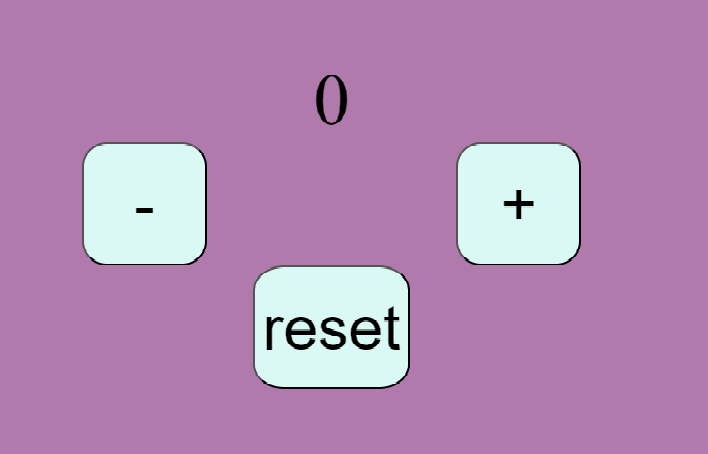
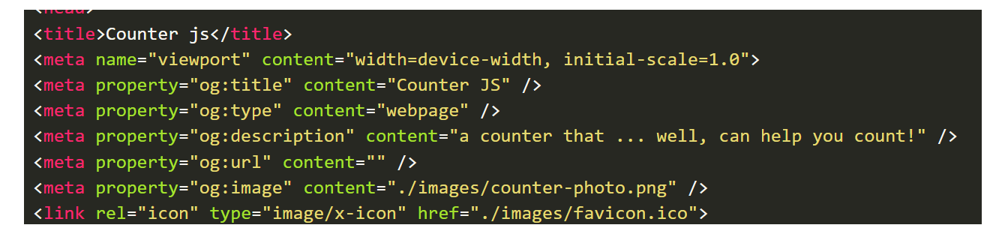
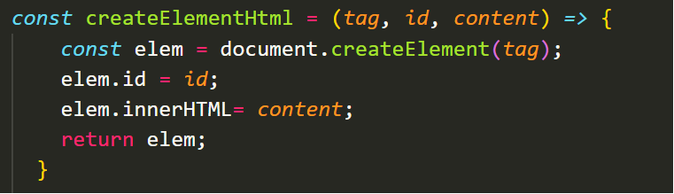
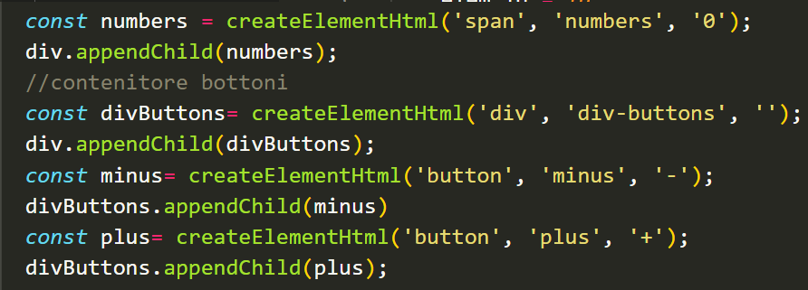
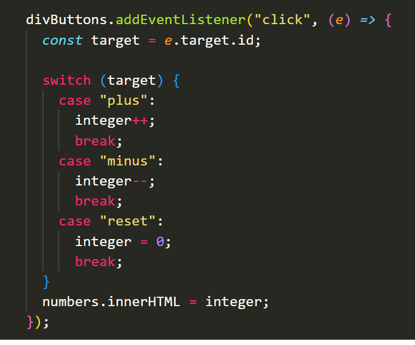

# Start to impact project: create a counter with javascript

---

## programming languaes used:

html, css, javascript

## first step:

I created an almost empty **html file**, with the `<meta>` tags:

## second step:

I added a **javascript file** to my html file;
At first you can notice a function that can create html elmements:

If I declare tag name, Id and content of the element, this function provides for me DOM manipulation and proceed to create what I requested.

## third step

Now that I have all the Dom elements, I can add one event with different cases.

## how to use:

press `+` or `-` to increase or decrease the value of the counter. Press `reset` to retun 0 as value.

## link:

[counter js](https://annamilano1.github.io/counter-in-js/)
